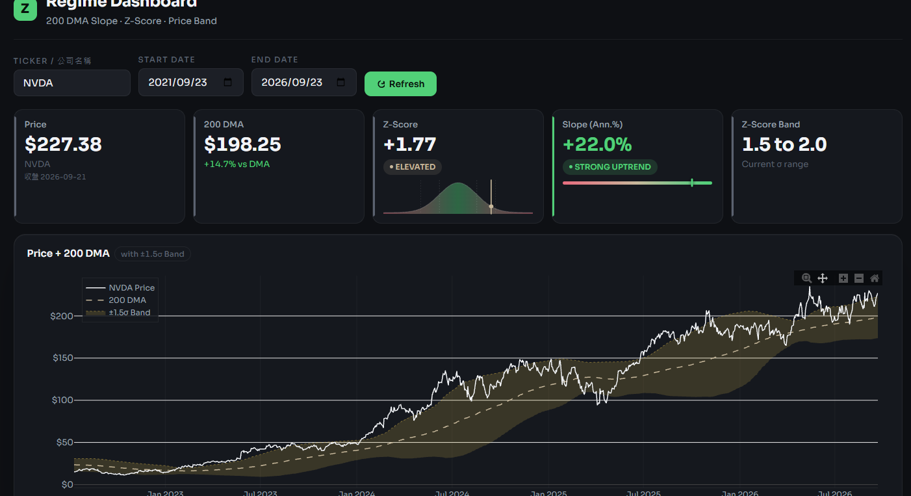
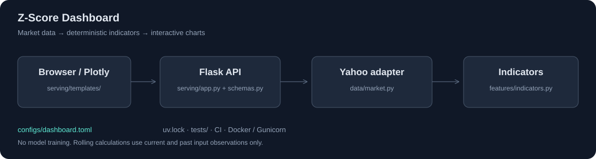

# Z-Score Dashboard｜股票趨勢觀察儀表板

輸入股票代號，就能在同一個畫面查看價格走勢、長期趨勢與價格偏離程度。

**[HF 線上體驗](https://lee851104-z-score-dashboard.hf.space/)** · **[Render 線上體驗](https://z-score-dashboard.onrender.com/)** · [HF 專案頁](https://huggingface.co/spaces/lee851104/z-score-dashboard) · [GitHub 原始碼](https://github.com/lee851104/z-score-dashboard)

## 1. 解決什麼問題

單看股價漲跌，無法同時看出價格與長期平均的距離，以及均線的變化方向。這個專案將行情下載、指標計算與圖表整合在同一個網頁，讓使用者一次比較價格位置與趨勢。

輸入 `NVDA`、`SPY` 或 `2330.TW` 等股票代號，即可查看：

- **股價與 200 日均線**：比較收盤價與最近 200 個交易日平均價格的位置。
- **Z-Score**：以標準差為單位，呈現價格偏離 200 日均線的程度。
- **均線斜率**：觀察長期趨勢向上或向下，以及變化幅度。

資料來自 Yahoo Finance 的調整後歷史價格。這是歷史資料觀察工具，指標不代表股票的合理價值，也不是買賣建議。

## 2. 操作畫面



## 3. 用了哪些技術？為什麼？

| 技術 | 用途與選擇原因 |
| --- | --- |
| Python、pandas、NumPy | 處理日期序列、計算移動平均、標準差與線性回歸斜率。 |
| yfinance | 取得 Yahoo Finance 的歷史行情，支援美股與台股等代號。 |
| Flask | 接收查詢並回傳結果；適合這類功能明確、規模精簡的網站。 |
| HTML、CSS、JavaScript、Plotly | 建立可拖曳、縮放的互動圖表，使用者透過瀏覽器即可操作。 |
| uv、pytest、Ruff | 鎖定套件版本，並檢查計算結果、API 行為與程式格式。 |
| GitHub Actions | 定義 Windows／Linux 的自動測試，以及 Docker 建置檢查流程。 |
| Docker、Gunicorn、Hugging Face Spaces | 以容器封裝執行環境，透過網頁服務提供公開體驗網址。 |

## 4. 架構

使用者提出查詢後，系統取得行情、計算指標，再將結果呈現在圖表上。各項工作分開管理，方便日後修改資料來源或增加指標。



```text
configs/                   計算參數與服務設定
src/zscore_dashboard/
├── data/                  取得、整理與檢查行情
├── features/              計算均線、Z-Score 與斜率
└── serving/               網頁、查詢 API 與回傳格式
tests/                     自動化測試
docs/                      架構與部署說明
reports/                   驗證結果與圖表
```

## 5. 工程亮點

- **計算與外部服務分離**：即使行情來源暫時無法連線，仍能用合成資料驗證計算與 API。
- **驗證計算不使用未來輸入**：以合成行情測試，確認改動未來價格或截短資料後，過去的指標結果保持一致。
- **36 項自動化測試通過**：2026-09-23 在 Windows／Python 3.12 執行，涵蓋計算公式、行情格式、API 回應與設定驗證。
- **保留既有功能**：5 組合成行情的完整 API 回傳與重構前一致，預設網頁渲染結果也保持一致。
- **確認打包後仍能執行**：檢查安裝套件內的程式、網頁模板與設定，並在專案目錄以外成功載入首頁。

已完成 NVDA 真實行情查詢與三張互動圖表的瀏覽器檢查。完整執行紀錄與驗證範圍見 [驗證報告](reports/validation.md)。

## 6. 快速開始

**直接體驗：** 開啟 [HF 線上版](https://lee851104-z-score-dashboard.hf.space/) 或 [Render 線上版](https://z-score-dashboard.onrender.com/)，輸入股票代號與日期區間。

**本機執行：** 先安裝 Python 3.11 以上與 [uv](https://docs.astral.sh/uv/)，在此版本的專案資料夾開啟終端機，執行：

```bash
uv sync --frozen
uv run --frozen python server.py
```

開啟 [http://127.0.0.1:5050](http://127.0.0.1:5050)。

執行自動化測試：

```bash
uv run --frozen pytest
```

## 7. 深入閱讀

- [指標方法與限制](MODEL_CARD.md)：公式、資料來源、適用情境與已知限制。
- [架構與部署](docs/architecture.md)：模組分工、API 與部署方式。
- [驗證報告](reports/validation.md)：測試結果、重構比對與驗證範圍。
- [參數設定](configs/dashboard.toml)：調整均線窗口、價格區間等設定。

## 8. 授權

本儲存庫未附開源授權檔；程式碼的使用、修改與散布授權，請聯絡 [專案作者](https://github.com/lee851104)。第三方套件與 Yahoo Finance 行情資料依各自的授權及使用條款辦理。
